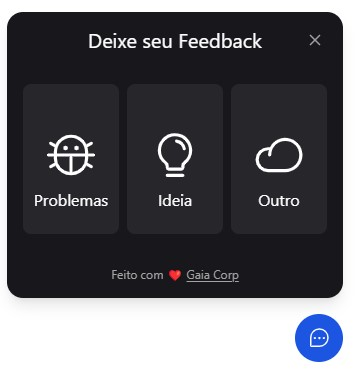

<h1 align="center"> Lgpd-cookie </h1>

<p align="center">
  Widget para envio de feedbacks
</p>

<p align="center">
  <a href="#-tecnologias">Tecnologias</a>&nbsp;&nbsp;&nbsp;|&nbsp;&nbsp;&nbsp;
  <a href="#-projeto">Projeto</a>&nbsp;&nbsp;&nbsp;|&nbsp;&nbsp;&nbsp;
  <a href="#memo-licença">Licença</a>
</p>

<p align="center">
  
</p>

<br>

<p align="center">
  
</p>

## 🐡 Tecnologias

Esse projeto foi desenvolvido com as seguintes tecnologias:

- Svelte
- HTML e CSS
- JavaScript

## 💻 Projeto

Adicione o script à sua pagina e em seguida chame o componente da seguinte forma:

```html
<script src="js/widget-feedux.js" type="module"></script>
<Widget-feedux />
```

## :memo: Licença

Esse projeto está sob a licença MIT.
